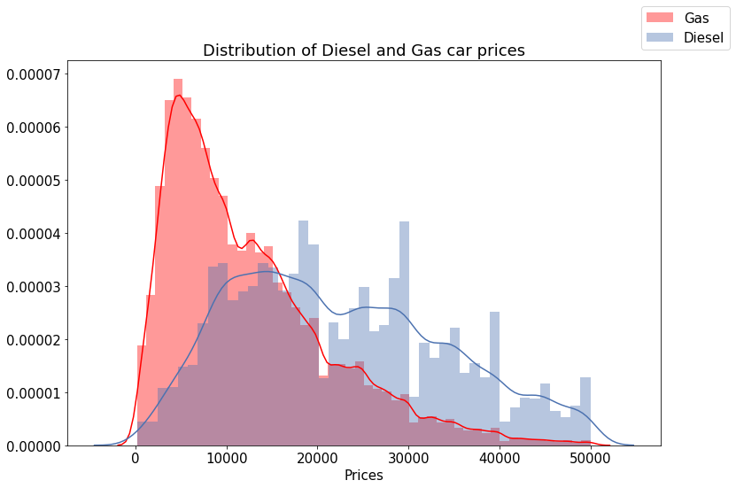
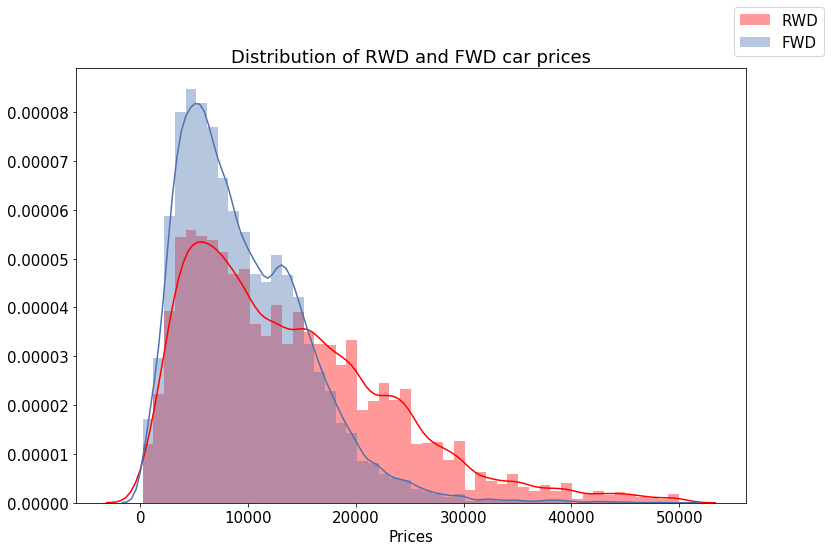
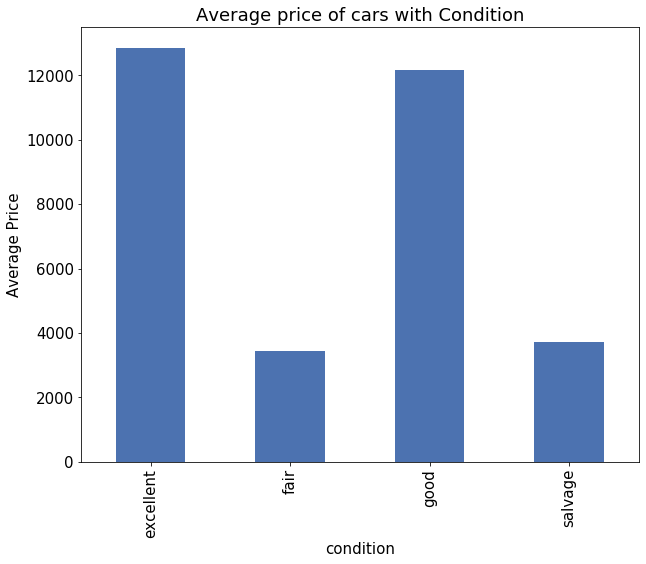
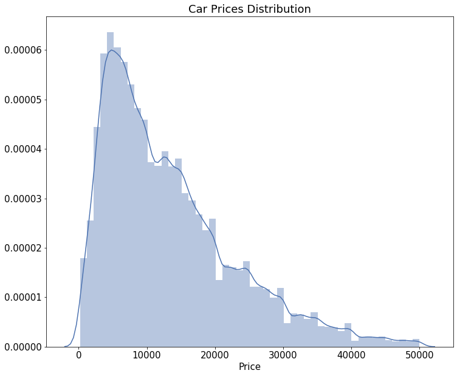
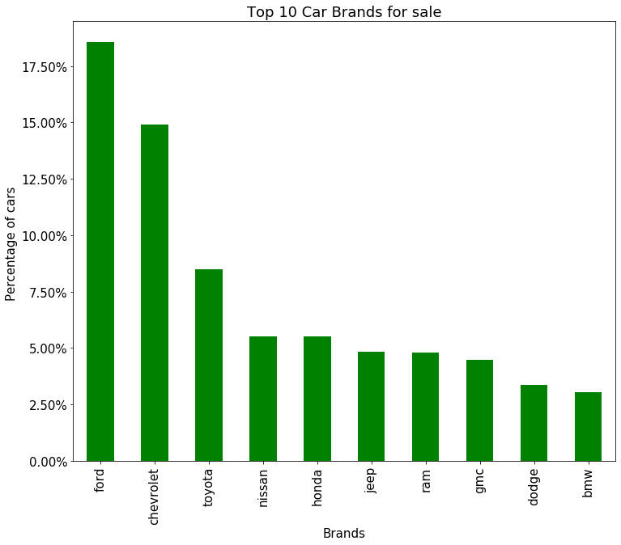
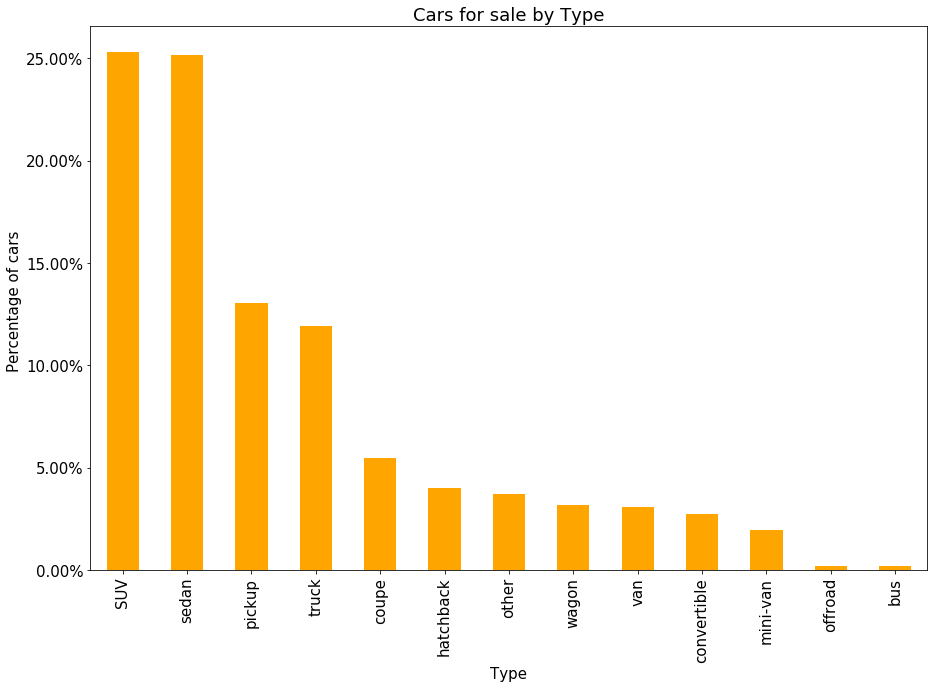
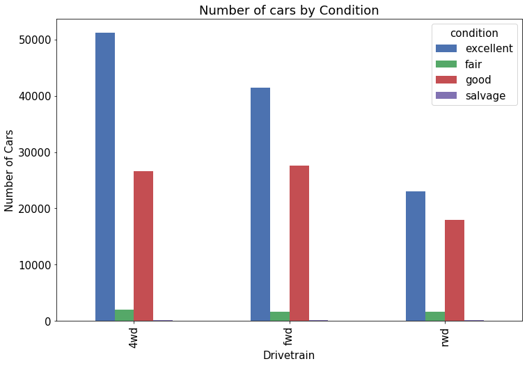

# Car Price Prediction
By: Jagandeep Singh

## Introduction
I used "Used Cars dataset" from kaggle by Austin Reese. This dataset initially
had 435849 rows. The dataset included price, year, make, model, mileage, condition,
title_status etc. I cleaned the dataset as much as I could. I ran three hypothesis
tests on different columns of the dataset. Main task in this project was to create
model that can predict car prices.

## Data Cleaning
The dataset initially had 435849 rows. About 30000 of the cars were listed at 0 and I
ended up removing all of them. Then I checked for nan values in other columns. Alot
of the columns had nan values. The column odometer had some missing values, I couldn't
just remove all those rows. So I replaced odometer values with median odometer value of
make year of that car. I dropped cars with price less than 1000 with miles less than 60,000
 and model year greater than 2010. After data cleaning I had only 387772 rows.

## Hypothesis tests
I performed three hypothesis tests on the data.
1. To check if there is a significant difference in  Mean price of diesel and gas cars.
\
2. To check if Mean price of rwd is lesser or equal than the mean price of fwd.
\
3. To check if there is a significant relation between price and condition.
\

## Feature Engineering
For Feature Engineering the main thing I did was to go through the description of
each car and check if it had certain words like "new tires", "heated seats",
"automatic headlights" and "leather" and created columns for each of these words.
I also created age of a car from the year.

## Data Analysis and Visualization
In my analysis, I checked the number of cars for sale by each brand. I created a
bar graph of top 10 brands with highest number of cars for sale. 17% of all the cars
were ford and chevrolet was second with 15% of the cars. Then I looked at the type of cars
on sale and most of them were SUVs and Sedans. I also compared car fuel types with average miles
to see what kind of vehicles average more miles. Some of the visualization are following:
\\

\\

\\

\\

## Feature Selection
For feature selection, I first checked for collinearity between all of the features.
Then I checked for variance inflation factor and removed some features. Train test split
was used to train model on the training data and then running it on test data. At first
I ran a linear regression model on the data with all of the features. Then I used the
kbest process with f-test to find the best features for model. Running the Model
did not gave me any better result than running with all features. I also used
Recursive feature elimination but that did not remove any feature from the dataset, so
the results were same. I ended up using the lasso model, which had better results than
all other models.

## Model
At first I ran baseline model on the dataset and got RMSE of 7971. I tried using the
same model with created dummy variables and brought down the RMSE to 6432. Using kbest brand
Recursive feature elimination only made the model RMSE worse. With Lasso model
the RMSE was almost same. So I used Lasso model to predict the prices for the whole
dataset.  

## Conclusion  
Even with Lasso model the Root Mean Squared Error was 6432, which is alot considering
the prices of cars. There are many more variables about a car that contribute to its price
than I had in this dataset e.g. Physical conditions of a car, cleaniness of a car or more
information about engine. In Future, I will find a better dataset with more variables and
fix this model.

Here is the link to my presentation:\
https://docs.google.com/presentation/d/1gWcfUn1kNUX9ts-PIlUbqwkl0uQv5NScSN42g_im-u8/edit?usp=sharing
